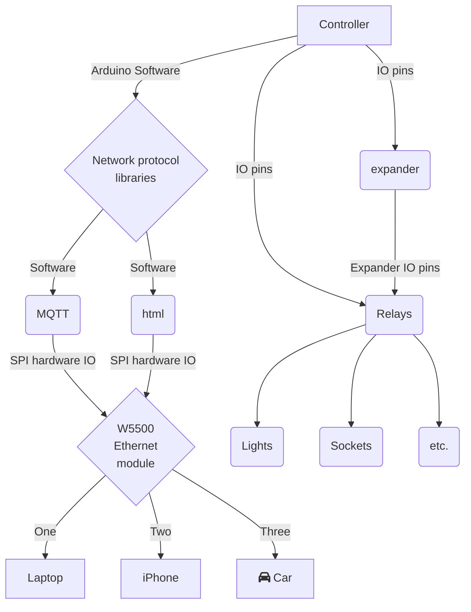

# Home Automation Arduino Ethernet Relay/Lights Controller

- This project aims to control lights using a wired Ethernet connection with the W5500 or W5100 module, instead of relying on Wi-Fi. Other Ethernet modules can be used with different libraries.

- This Arduino-based relay controller supports ATmega328P chips (Nano, Micro, UNO, etc.) using the W5500 or W5100 Ethernet modules.

- The controller features a web server on port 80 and an MQTT client to toggle relays, enabling control over outside lights in me case but could be anything that requires a relay etc. to turn it on and off.

- Switches can be connected to the Arduino pins for controlling the relays via MQTT or the web server on port 80.

### A chart to break up the text :D



## MQTT examples

To view MQTT messages on the server, run the following command:

```
mosquitto_sub -v -t '#' -F '%I %t %p'
```

- -v: Enables verbose output, displaying the topic and message.
- -t '#': Subscribes to all topics.
- -F '%I %t %p': Formats the output to display the client IP address (%I), topic (%t), and message payload (%p).

### to control a light

To turn off a light:

```
mosquitto_pub -h localhost -t h1/c1/outside/s/e -m 0
```

To turn on a light:

```
mosquitto_pub -h localhost -t h1/c1/outside/s/e -m 0
```

The controller board will publish the following messages when it successfully switches the light on/off:

```
state/h1/c1/outside/s/e s=0
state/h1/c1/outside/s/e s=1
```

The prefix <b>state/</b> is added to the topic to indicate that the device has been updated. It helps avoid confusion between device updates and commands to control the board.

## HTML Interface

To access the HTML interface of the controller, follow these steps:

1. Connect your device to the same network as the controller.
2. Open a web browser (e.g., Chrome, Firefox) on your device.

If your controller module uses the default IP address of `192.168.1.170`, enter the following URL in your web browser's address bar:

```
http://192.168.1.170
```

- **Note:** Depending on your controller device/modules configuration, the IP address of the controller module might be different. Make sure to use the correct IP address assigned to your module.

- Once the web page loads, you will have access to the HTML interface, where you can control and monitor the lights connected to the relay controller. The interface provides an intuitive user interface with options to turn on/off the lights and view their current status.

- **Important:** Some web browsers may display a security warning for non-encrypted connections. If you encounter such a warning, you can proceed by accepting the risk or configuring your browser to allow connections to non-encrypted pages.

- Feel free to explore the HTML interface and interact with the lights according to your requirements.

## about the code

### Arduino library's:

1. The arduino ethernet library: www.arduino.cc/reference/en/libraries/ethernet/
1. knolleary/PubSubClient

TODO:
remove hn.h as rewriting and do not need for now.(home basic network)
update I.h to the newer lib(local pin input connected to wall switches)
change IO.h expander to the newer lib.
O.h as IO.h
update mqtt.h the use stringConst.h
move mqtt.h to a lib.
pStr.h use the lib instead.
s.h is setup? rename to config.h
